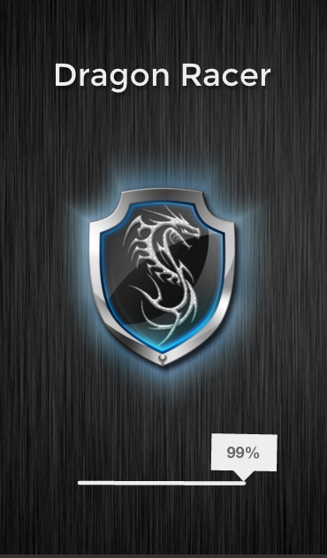
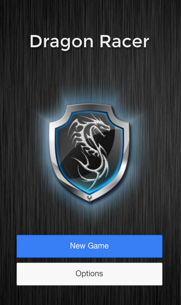
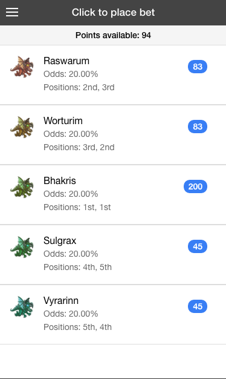
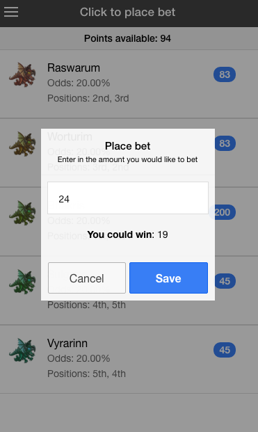
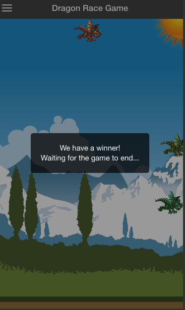
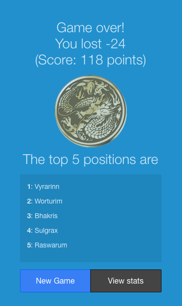
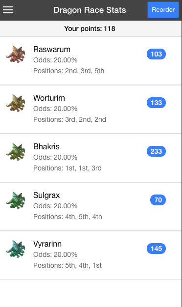
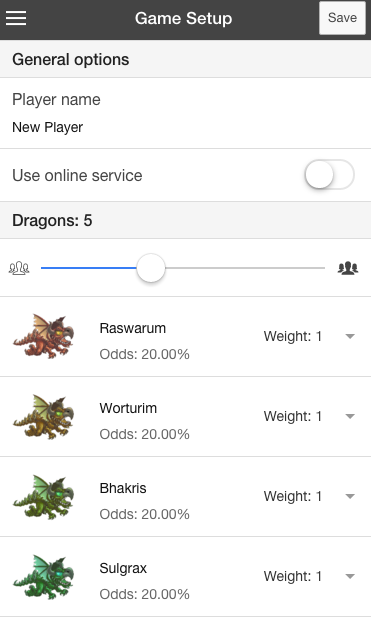

Dragon Racer (ionic)
=====================

# dragonracer
A one week Ionic Framework and Cordova project featuring pixie (2d animation library), gsap (tween), sass, and angular audio.

(for the Angular2/Ionic2 version visit https://github.com/shaunnez/dragonracer2) 

The game is simple, choose how many dragons you want, change the "odds" of each dragon winning (i.e. a real horse race) and bet on the dragon. Utilising a random generator, simulate a real betting and racing enviroment.

All options are configurable (including what animates, how many "steps" there are in the race, disable audio, name each dragon etc). The random generator is stored locally, but can easily be moved to an external API and the app can connect to this instead.

## Installation

You will need to include ionic-cli on your computer, then git clone the repo and run npm install && bower install. To run it, simply open your terminal/cmd prompt, cd to the directory, and run ionic serve.

Even better, download the ionic app and simulate it running on your phone!

